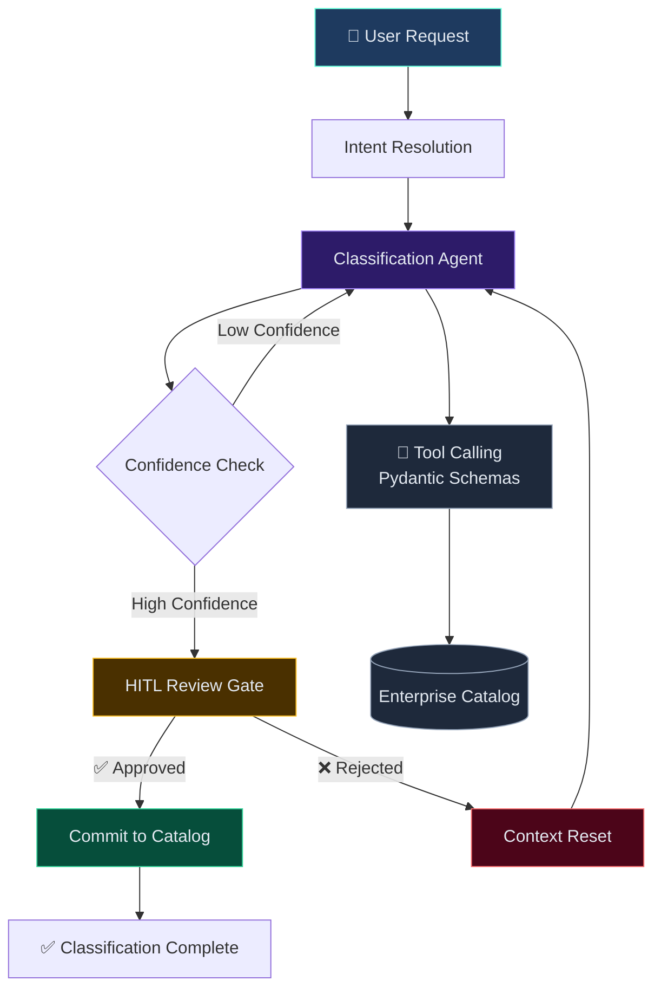

# LangGraph HITL Demo — Data Classification Pattern

> Demonstrates the **agentic AI orchestration pattern** I built for an enterprise data classification system — using LangGraph state machines, HITL workflows, and tool calling with Pydantic validation.

## What This Showcases

This is a simplified, self-contained prototype of the **Agentic AI–Powered Data Classification System** I designed for enterprise data integrity — no API keys or LLMs required.

### Patterns Demonstrated

| Pattern | Implementation |
|---|---|
| **LangGraph State Machine** | Graph with nodes, conditional edges, and state transitions |
| **HITL (Human-in-the-Loop)** | Graph pauses at review gate, resumes on human decision |
| **Checkpointing** | Full state persistence for pause/resume across sessions |
| **Tool Calling** | Pydantic-validated tool schemas for classification, catalog query |
| **Context Reset** | Clears agent context on rejection to prevent bias on retry |
| **Conditional Routing** | Dynamic edge selection based on confidence and approval |

## Architecture



## Running

```bash
pip install langgraph langchain-core pydantic
python -m src.graph
```

No API keys needed — all LLM calls are mocked with deterministic responses.

## Project Structure

```
src/
├── state.py       # TypedDict state definition with reducers
├── tools.py       # Pydantic-schema tool definitions (mocked)
├── nodes.py       # Node functions — classify, review, commit, reset
├── routing.py     # Conditional edge logic
└── graph.py       # Full graph assembly + demo runner
```

## From My Resume

> *"Designed a multi-agent AI system using LangGraph state-machine orchestration for automated CDE/PII classification — with intent resolution, scope validation, checkpoint-based HITL review, and MCP-based enterprise catalog integration."*

This repo distills that production system into a runnable pattern.
